```{r include=FALSE}
# Carga de paquetes
library(tidyverse)
library(knitr)
library(kableExtra)
```

# Estadística {.small-text}


# Analítica {.small-text}


# Algunas aplicaciones en ingeniería mecánica {.small-text}

-   **Análisis de vibraciones:** ¿Qué frecuencias de vibración son más
    críticas para la integridad de una estructura mecánica?
-   **Diseño de experimentos:** ¿Cuál es la combinación óptima de
    materiales para maximizar la resistencia de un componente?
-   **Gestión de activos:** ¿Cómo podemos predecir el desgaste de una
    pieza mecánica en función del tiempo y uso?
-   **Simulación y modelado:** ¿Cómo podemos modelar el comportamiento
    térmico de un motor bajo diferentes condiciones operativas?

# Algunas aplicaciones en ingeniería eléctrica {.small-text}

-   **Análisis de confiabilidad:** ¿Cuál es la vida útil esperada de un
    componente eléctrico en diferentes condiciones operativas?
-   **Optimización de redes eléctricas:** ¿Cuál es la configuración
    óptima de una red eléctrica para minimizar pérdidas de energía?
-   **Control de calidad:** ¿Cómo podemos monitorear y mejorar la
    calidad de la producción de componentes electrónicos?
-   **Análisis de fallas:** ¿Qué factores están más correlacionados con
    fallas en sistemas eléctricos?
-   **Predicción de demanda:** ¿Cómo podemos predecir la demanda de
    electricidad en diferentes periodos del año?

# Algunas aplicaciones en ingeniería industrial {.small-text}

-   **Optimización de la producción:** ¿Cuál es la secuencia óptima de
    producción para minimizar los tiempos de espera y maximizar la
    eficiencia?
-   **Análisis de capacidad:** ¿Cuál es la capacidad máxima de una línea
    de producción sin comprometer la calidad?
-   **Control de calidad:** ¿Cómo podemos reducir la variabilidad en la
    producción para mejorar la calidad del producto?
-   **Estudio de tiempos y movimientos:** ¿Cuáles son los factores que
    más afectan el tiempo de ciclo en una línea de ensamblaje?
-   **Análisis de datos de ventas:** ¿Qué factores están más
    correlacionados con el aumento de las ventas de un producto
    específico?

# Algunas aplicaciones en ingeniería civil {.small-text}

-   **Análisis de riesgos:** ¿Cuál es la probabilidad de falla de una
    estructura bajo diferentes cargas y condiciones ambientales?
-   **Control de calidad en materiales:** ¿Cómo podemos monitorear y
    mejorar la calidad del concreto utilizado en una construcción?
-   **Estudios geotécnicos:** ¿Cuál es la distribución de las
    propiedades del suelo en una zona específica?
-   **Optimización de recursos:** ¿Cuál es la cantidad óptima de
    materiales necesarios para una construcción sin exceder el
    presupuesto?
-   **Simulación de tráfico:** ¿Cómo podemos modelar y predecir el flujo
    de tráfico en una nueva carretera para minimizar los
    congestionamientos?

# Algunas aplicaciones en ingeniería de sistemas {.small-text}

-   **Análisis de datos de usuarios:** ¿Cuáles son los patrones de uso
    más comunes de una aplicación y cómo podemos mejorar la experiencia
    del usuario?
-   **Predicción de fallos en sistemas:** ¿Qué factores están más
    correlacionados con fallas en un sistema informático?
-   **Análisis de rendimiento:** ¿Cómo podemos mejorar el rendimiento de
    una base de datos en función de los patrones de acceso?
-   **Seguridad informática:** ¿Cuál es la probabilidad de un ataque de
    seguridad basado en los patrones de tráfico de red?
-   **Optimización de algoritmos:** ¿Cómo podemos mejorar la eficiencia
    de un algoritmo de búsqueda?

# Algunas aplicaciones en ingeniería agroindustrial {.small-text}

-   **Optimización de cultivos:** ¿Cuál es la combinación óptima de
    fertilizantes y riego para maximizar el rendimiento de un cultivo?
-   **Control de calidad en alimentos:** ¿Cómo podemos reducir la
    variabilidad en la producción de alimentos para mejorar la calidad y
    seguridad?
-   **Estudios de impacto ambiental:** ¿Cómo podemos medir y reducir el
    impacto ambiental de prácticas agrícolas específicas?
-   **Predicción de plagas:** ¿Cómo podemos predecir la aparición de
    plagas en un cultivo en función de las condiciones climáticas y
    otros factores?

# Elementos clave

::: columns
::: {.column width="50%"}

:::

::: {.column width="50%"}

:::
:::

# Ejemplo de aplicación {.small-text}

::: columns
::: {.column width="30%"}
{height="250"}
{height="250"}
:::

::: {.column width="70%"}
[](0_Resources/how-target-figured-out-a-teen-girl-was-pregnant-before-her-father-did.html)
:::
:::

# Áreas complementarias


# Introducción

### ¿Para qué sirve este curso?

-   Describir y analizar conjuntos de datos.
-   Análisis de fenómenos aleatorios en ingeniería.
-   Definir metodologías de muestreo.
-   Aplicar modelos de regresión.

## Contenido


## Contenido



## Evaluación

::: columns
::: {.column width="25%"}
**Módulo I (30%)**

\- Evaluación continua (50%)

\- Taller EDA (50%)
:::

::: {.column width="25%"}
**Módulo II (15%)**

\- Evaluación continua (50%)

\- Taller de probabilidad (50%)
:::

::: {.column width="25%"}
**Módulo III (15%)**

\- Evaluación continua (50%)

\- Taller de inferencia y pruebas de hipótesis (50%)
:::

::: {.column width="25%"}
**Módulo IV (40%)**

\- Evaluación continua (50%)

\- Taller de regresión y muestreo (50%)
:::
:::

## Recursos guía

::: nonincremental
-   Chang (2024). R Graphics Cookbook (2nd ed.)
-   Crawley (2015). Statistics: and introduction using R
-   Koralov y Sinai (2012). Theory of Probability and Random Processes
    (2nd ed.)
-   Tattar, Ramaiah y Manjunath (2016). A course in statistics with R
-   Wackerly et al. (2008). Estadística matemática con aplicaciones (7ma
    ed.)
-   Wickman et al. (2023). R for Data Science (2nd ed.)
-   Wickman et al. (2023). ggplot2 (2nd ed.)
:::

## Software del curso

::: columns
::: {.column width="50%"}

:::

::: {.column width="50%"}

:::
:::

### Software estadístico {.stretch}

::: columns
::: {.column width="30%"}

{height="150"}
{height="180"}
:::

::: {.column width="30%"}
 
:::

::: {.column width="30%"}
 

:::

::: {.column width="10%"}
{width="\"100%"} **Matlab**
:::
:::

### Software estadístico


### Software estadístico


## Presentación

::: notes
Mencionar los acuerdos de clase: - No responder a no ser que le sea
consultado directa o abiertamente.
:::

# Módulo I: Introducción

::: nonincremental
-   Variables
-   Medidas de tendencia central
-   Medidas de dispersión
-   Gráficas
-   Teoría de conjuntos
-   Técnicas de conteo
-   Probabilidad
:::

## Variables


## Medidas de tendencia central

### Media

$\begin{equation}
\bar{X} = \frac{\sum_{i=1}^{n} X_{i}}{n}
\end{equation}$

**Ventaja:** fácil de interpretar y calcular.

**Desventaja:** sensible a valores extremos.

### Mediana

Es el valor que se encuentra en el centro de una secuencia ordenada de
datos. Hay la misma cantidad de datos por encima y por debajo de ella.

$\begin{equation}
\text{Mediana} =
\begin{cases}
X_{\frac{n+1}{2}}, & \text{si } n \text{ es impar} \\
\frac{X_{\frac{n}{2}} + X_{\frac{n}{2} +1}}{2}, & \text{si } n \text{ es par}
\end{cases}
\end{equation}$

**Ventaja:** fácil de interpretar y calcular, no es sensible a valores
extremos.

### Moda

Es el valor que aparece con mayor frecuencia, se utiliza en fines
descriptivos ya que es muy variable para diferentes muestras. Puede
haber más de una moda.

Un conjunto de datos puedes ser unimodal, bimodal o multimodal.

### Ejemplo

Calcular la media, mediana y moda de la edad, altura y dinero en
efectivo de los estudiantes del grupo 6 de Estadística General:

```{r}
library(dplyr)
library(kableExtra)

link_encuesta <- "https://docs.google.com/spreadsheets/d/e/2PACX-1vRSn6T8sclb-P9UeGkh305w-8fs-rPR1_ritC2FPOLS2Ub13KUr_vF1dvRb0ZYr582s3aXD2gEVziGL/pub?gid=1539739636&single=true&output=csv"

data <- read.csv("0_Resources/data_ejemplo_sin_ajustar_1.csv")
titulos <- c("Id", "Timestamp", "Edad", "Altura (cm)", "Dinero en efectivo (COP)")
colnames(data) <- titulos

data %>% 
  select(-c(Timestamp)) %>% 
  kbl(align = "c") %>% 
  kable_material(c("striped", "hover")) %>% 
  row_spec(1:nrow(data), extra_css = "text-align: center; vertical-align: middle;") %>% 
  scroll_box(width = "100%", height = "400px")
```

### Ejemplo

Calcular la media, mediana y moda de la edad, altura y dinero en
efectivo de los estudiantes del grupo 6 de Estadística General:

```{r}
library(dplyr)
library(kableExtra)

link_encuesta <- "https://docs.google.com/spreadsheets/d/e/2PACX-1vRSn6T8sclb-P9UeGkh305w-8fs-rPR1_ritC2FPOLS2Ub13KUr_vF1dvRb0ZYr582s3aXD2gEVziGL/pub?gid=1539739636&single=true&output=csv"

data <- read.csv(link_encuesta)
data <- cbind(c(1:length(data$Edad)), data)
titulos <- c("Id", "Timestamp", "Edad", "Altura (cm)", "Dinero en efectivo (COP)")
colnames(data) <- titulos

data %>% 
  select(-c(Timestamp)) %>% 
  kbl(align = "c") %>% 
  kable_material(c("striped", "hover")) %>% 
  row_spec(1:nrow(data), extra_css = "text-align: center; vertical-align: middle;") %>% 
  scroll_box(width = "100%", height = "400px")
```

### Ejemplo

::: panel-tabset
### Output

```{r}
# Formula moda
moda <- function(x) {
  ux <- unique(x)
  ux[which.max(tabulate(match(x, ux)))]
}


# Edad
media_edad <- round(mean(data$Edad), digits=2)
mediana_edad <- median(data$Edad)
moda_edad <- moda(data$Edad)

# Altura
media_altura <- round(mean(data$`Altura (cm)`), digits=2)
mediana_altura <- median(data$`Altura (cm)`)
moda_altura <- moda(data$`Altura (cm)`)

# Dinero
media_dinero <- round(mean(data$`Dinero en efectivo (COP)`), digits=2)
mediana_dinero <- median(data$`Dinero en efectivo (COP)`)
moda_dinero <- moda(data$`Dinero en efectivo (COP)`)

print(paste0("La variable Edad (años) tiene una media de ", media_edad, ", su mediana es ", mediana_edad, " y su moda es ", moda_edad))

print(paste0("La variable Altura (cm) tiene una media de ", media_altura, ", su mediana es ", mediana_altura, " y su moda es ", moda_altura))

print(paste0("La variable Dinero (COP) tiene una media de ", media_dinero, ", su mediana es ", mediana_dinero, " y su moda es ", moda_dinero))

```

### R code

``` r
# Formula moda
moda <- function(x) {
  ux <- unique(x)
  ux[which.max(tabulate(match(x, ux)))]
}


link_encuesta <- "https://docs.google.com/spreadsheets/d/e/2PACX-1vRSn6T8sclb-P9UeGkh305w-8fs-rPR1_ritC2FPOLS2Ub13KUr_vF1dvRb0ZYr582s3aXD2gEVziGL/pub?gid=1539739636&single=true&output=csv"

data <- read.csv(link_encuesta)

# Edad
media_edad <- round(mean(data$Edad), digits=2)
mediana_edad <- median(data$Edad)
moda_edad <- moda(data$Edad)

# Altura
media_altura <- round(mean(data$Altura..cm.), digits=2)
mediana_altura <- median(data$Altura..cm.)
moda_altura <- moda(data$Altura..cm.)

# Dinero
media_dinero <- round(mean(data$Dinero.en.efectivo), digits=2)
mediana_dinero <- median(data$Dinero.en.efectivo)
moda_dinero <- moda(data$Dinero.en.efectivo)

print(paste0("La variable Edad (años) tiene una media de ", media_edad, ", su mediana es ", mediana_edad, " y su moda es ", moda_edad))

print(paste0("La variable Altura (cm) tiene una media de ", media_altura, ", su mediana es ", mediana_altura, " y su moda es ", moda_altura))

print(paste0("La variable Dinero (COP) tiene una media de ", media_dinero, ", su mediana es ", mediana_dinero, " y su moda es ", moda_dinero))
```
:::

## Medidas de dispersión

### Rango

$\begin{equation}
Rango = Valor_{máximo} - Valor_{mínimo}
\end{equation}$

**Propiedades:**

-   Fácil de calcular.
-   Sensible a valores extremos.
-   No considera la distribución de los datos.
-   Posible dependencia del tamaño de la muestra.
-   Puede ser problemático para comparar diferentes conjuntos de datos o
    muestras.
-   Brinda una vista rápida y sencilla de la dispersión y sobre la
    presencia de datos atípicos significativos.

### Varianza

::: columns
::: {.column width="50%"}
$\begin{equation}
\sigma^2 = \frac{1}{N} \sum_{i=1}^{N} (x_i - \mu)^2
\end{equation}$
:::

::: {.column width="50%"}
$\begin{equation}
s^2 = \frac{1}{n-1} \sum_{i=1}^{n} (x_i - \bar{x})^2
\end{equation}$
:::
:::

#### Propiedades de la varianza

::: small-text
-   Siempre es positiva.
-   Sensible a valores extremos, aunque de manera más equilibrada que el
    rango.
-   Unidades cuadradas.
-   Aditividad: la varianza de la suma de variables aleatorias
    independientes es igual a la suma de sus varianzas individuales.
-   Permite comparar diferentes conjuntos de datos.
-   Dependencia del escalado

$\begin{equation}
Y = aX \\
Var(Y) = a^2 Var(X)
\end{equation}$
:::

#### ¿Por qué en la expresión de la varianza se utiliza el cuadrado de las diferencias en vez de su valor absoluto?

### Desviación estándar

::: columns
::: {.column width="50%"}
$\begin{equation}
\sigma = \sqrt{\frac{1}{N} \sum_{i=1}^{N} (x_i - \mu)^2}
\end{equation}$
:::

::: {.column width="50%"}
$\begin{equation}
s = \sqrt{\frac{1}{n-1} \sum_{i=1}^{n} (x_i - \bar{x})^2}
\end{equation}$
:::
:::

#### Propiedades de la desviación estándar

-   Mismas unidades que los datos.
-   Interpretación directa.
-   Sensible a valores extremos.
-   Propiedad de escalabilidad: si $Y = aX$, $Std(Y) = |a|*Std(X)$.
-   Aditividad en variables independientes:
    $Std(X+Y) = \sqrt{Var(X) + Var(Y)}$.
-   Sensible a outliers.
-   Asume distribución simétrica.

### Coeficiente de variación

$\text{Coeficiente de Variación} = \frac{\text{Desviación Estándar}}{\text{Media}} \times 100\%$

## Medidas de forma

### Coeficiente de asimetría (skewness)

Indica hacia dónde están sesgados los datos.

$\text{As} = \sum_{i=1}^{n} \frac{(X_{i}-\bar{X})^2}{ns^3}$

Valores:

$[-0.5 , 0.5] \text{ ...Simétrico}$

$[-1, -0.5) \text{ ó } (0.5, 1] \text{ ...Sesgo moderado}$

$As < -1 \text{ ó } As>1 \text{ ...Muy sesgado}$

### Coeficiente de asimetría (skewness)


### Coeficiente de asimetría (skewness)


### Curtosis

Indica cuán "chata" o alta es la distribución

$\text{kur} = \sum_{i=1}^{n} \frac{(X_i - \bar{X})^4}{ns^4}$


## Medidas de posición (cuantiles)

Los cuantiles sirven para estudiar o analizar lo que sucede con algún
porcentaje de datos en particular, cuando se han ordenado previamente
los datos. Los cuantiles se dividen en cuartiles, deciles y percentiles.

### p-tiles

::: small-text
-   *Cuartil:* genera cuatro intervalos, cada uno con el 25% de los
    casos.
-   *Quintil:* genera cinco intervalos, cada uno con el 20% de los
    casos.
-   *Decil:* genera 10 intervalos, cada uno con el 10% de los casos.
-   *Veintil:* genera 20 intervalos, cada uno con el 5% de los casos.
-   *Percentil:* genera 100 intervalos, cada uno con el 1% de los casos.
-   *N personalizado:* es posible determinar el número de intervalos,
    según sea la necesidad. Por ejemplo, un valor de 3 produciría 3
    categorías agrupadas (2 puntos de corte), cada una de las cuales
    contendría el 33.3% de los casos.
:::

#### Percentiles

El percentil es un valor tal que el **P** por ciento de las
observaciones son menores a tal valor.

**Ejemplo:** suponga que la nota del parcial es 4.1 y esa nota
corresponde al percentil 90. Esto indica que el 90% de los estudiantes
obtuvieron una nota entre 0.0 y 4.1 o que sólo el 10% sacó más de 4.1.

Para calcular los percentiles primero se deben ordenar los datos.

#### Percentiles

$$\text{Dec} = \frac{i*n}{100} \text{ ; i es el percentil a calcular} $$

$$P_{i} = \begin{cases} 
X_{(\lfloor Dec \rfloor + 1)} & \text{si } Dec \neq 0 \\
\frac{X_{Dec} + X_{Dec+1)}}{2} & \text{si } Dec = 0 
\end{cases}$$

Datos: 11 , 13 , 16 , 20 , 21

$P_{10} = ?$ \hspace{3cm} $P_{95} = ?$ \hspace{3cm} $P_{73} = ?$\
$P_{20} = ?$ \hspace{3cm} $P_{50} = ?$

## Tablas de frecuencias

```{r}
titulos <- c("Intervalo", "Mc", "fi", "Fi", "hi", "Hi")
X1 <- c("[0.5-1.3)","[1.3-2.1)","[2.1-2.9)","[2.9-3.7)","[3.7-4.5]")
X2 <- c(0.9,1.7,2.5,3.3,4.1)
X3 <- c(4,6,4,7,4)
X4 <- c(4,10,14,21,25)
X5 <- c(0.16,0.24,0.16,0.28,0.16)
X6 <- c(0.16,0.4,0.56,0.84,1)

df <- as_tibble(cbind(X1,X2,X3,X4,X5,X6))
colnames(df) <- titulos

df %>% 
  kbl(align = "c") %>% 
  kable_material(c("striped", "hover")) %>% 
  row_spec(1:nrow(df), extra_css = "text-align: center; vertical-align: middle;")
```

## Tablas de frecuencias

::: small-text
**Notas**: {1.2, 1, 0.6, 0.5, 1.3, 2, 2, 1.8, 1.9, 1.4, 2.5, 2.4, 2.3,
2.8, 3, 3.1, 3, 3.5, 2.9, 3.4, 3.6, 4.5, 3.7, 3.8, 3.9}

```{r}
titulos <- c("Intervalo", "Mc", "fi", "Fi", "hi", "Hi")
X1 <- c("","","","","")
X2 <- c("","","","","")
X3 <- c("","","","","")
X4 <- c("","","","","")
X5 <- c("","","","","")
X6 <- c("","","","","")

df <- as_tibble(cbind(X1,X2,X3,X4,X5,X6))
colnames(df) <- titulos

df %>% 
  kbl(align = "c") %>% 
  kable_material(c("striped", "hover")) %>% 
  row_spec(1:nrow(df), extra_css = "text-align: center; vertical-align: middle;")
```

::: columns
::: {.column width="50%"}
$MC = \text{Marca de clase}$

$fi = \text{Frecuencia absoluta}$

$Fi = \text{Frecuencia absoluta acumulada}$
:::

::: {.column width="50%"}
$hi = \text{Frecuencia relativa}$

$Hi = \text{Frecuencia relativa acumulada}$
:::
:::
:::

## Cálculo de Marca de clase

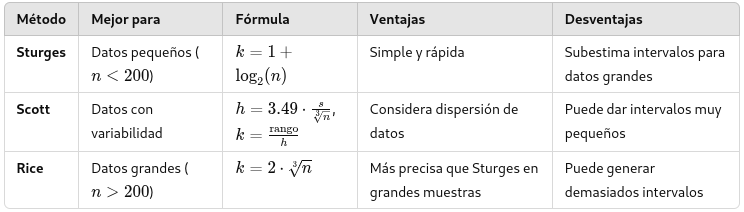

## Cálculos sobre datos agrupados

::: small-text
::: columns
::: {.column width="50%"}
**Media aritmética** $$\begin{equation}
\bar{X} = \sum_{i=1}^m \frac{f_i * M_c}{n}
\end{equation}$$

$\text{m = número de clases}$

**Mediana** $$\begin{equation}
\text{Me} = Linf_{i} * \frac{\frac{n}{2} - F_{i-1}}{f_{i}}*a
\end{equation}$$

$\text{a= ancho de clase}$
$\text{i = # de intervalo cuya frecuencia acumulada supera } \frac{n}{2}$
$Linf_{i} = \text{Límite inferior del intervalo i}$
:::

::: {.column width="50%"}
**Varianza** $$\begin{equation}
V(X) = \sum_{i=1}^m \frac{(Mc_{i} - \bar{X})^2*f_{i}}{n-1}
\end{equation}$$
:::
:::
:::

## Gráficas básicas

::: nonincremental
-   Diagrama de barras (bar plot)
-   Diagrama de dispersión (scatter plot)
-   Diagrama de líneas (line chart)
-   Histograma (Histogram)
-   Diagrama de ojiva (Ogive graph)
-   Diagrama circular (pie chart)
-   Diagrama de cajas / Diagrama de caja y bigotes (boxplot)
:::

## Gráficas

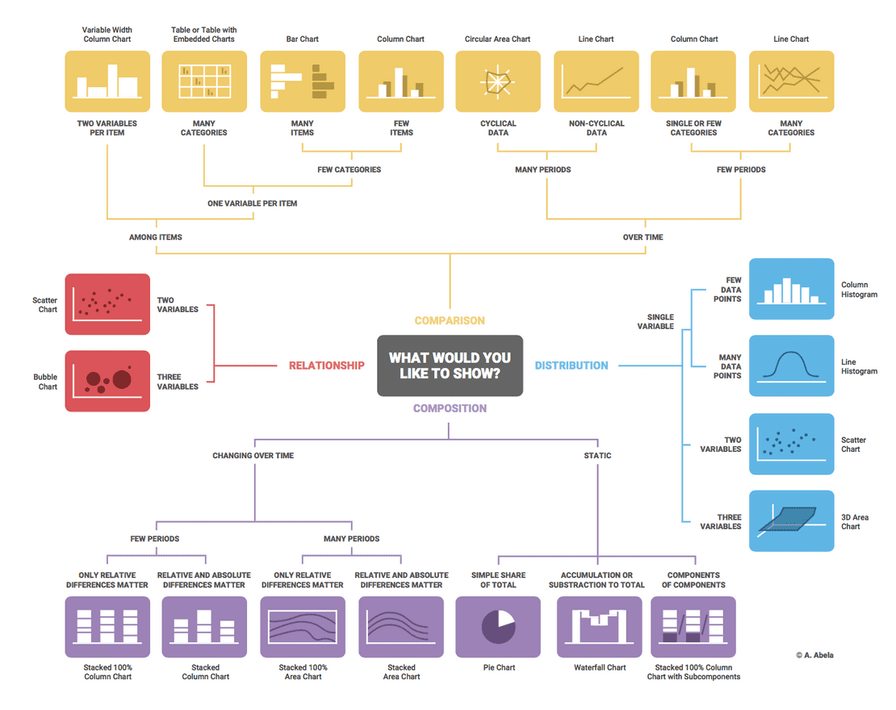{height="30%"}
Tomado de https://biuwer.com/es/blog/como-elegir-el-grafico-adecuado-para-tus-datos/

## Gráficas


Adaptado de https://biuwer.com/es/blog/como-elegir-el-grafico-adecuado-para-tus-datos/

## Gráficas

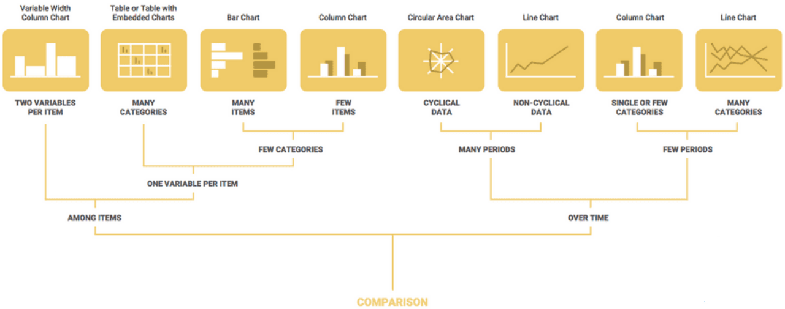

::: smaller-text
Adaptado de https://biuwer.com/es/blog/como-elegir-el-grafico-adecuado-para-tus-datos/
:::

## Gráficas

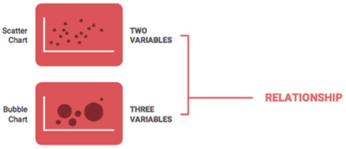

::: smaller-text
Adaptado de https://biuwer.com/es/blog/como-elegir-el-grafico-adecuado-para-tus-datos/
:::

## Gráficas

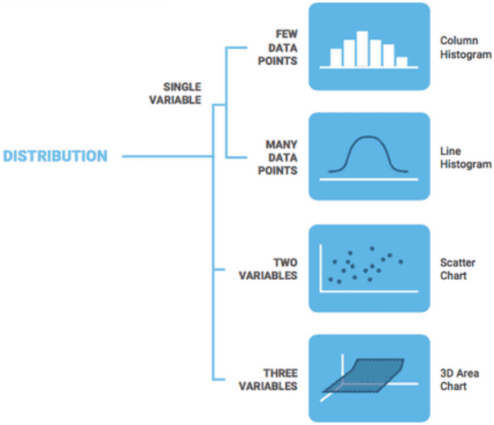

::: smaller-text
Adaptado de https://biuwer.com/es/blog/como-elegir-el-grafico-adecuado-para-tus-datos/
:::

## Gráficas

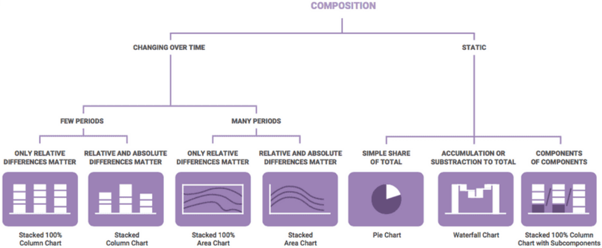

::: smaller-text
Adaptado de https://biuwer.com/es/blog/como-elegir-el-grafico-adecuado-para-tus-datos/
:::

## Gráficas - Amounts

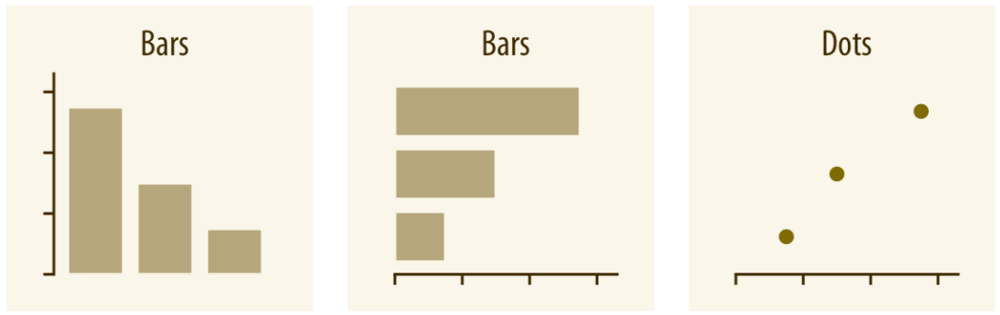

::: smaller-text
Tomado de Fundamentals of Data Visualization, Wilke (2019)
:::

## Gráficas - Amounts

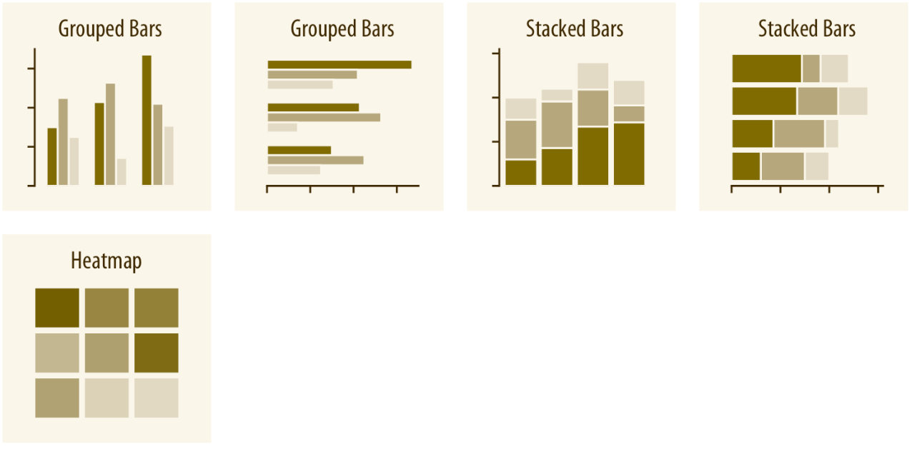

::: smaller-text
Tomado de Fundamentals of Data Visualization, Wilke (2019)
:::

## Gráficas - Distributions

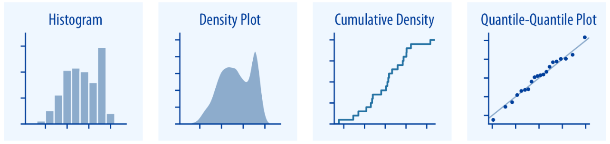

::: smaller-text
Tomado de Fundamentals of Data Visualization, Wilke (2019)
:::

## Gráficas - Distributions

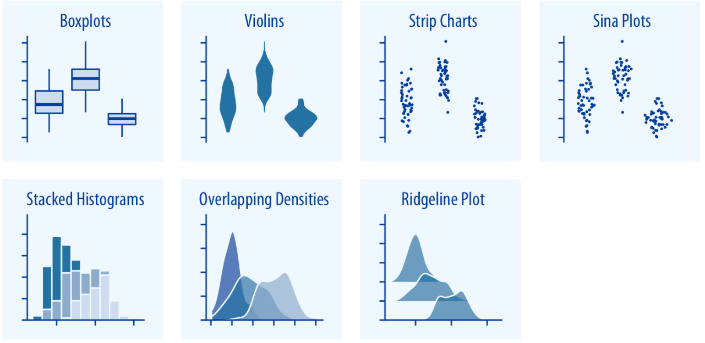

::: smaller-text
Tomado de Fundamentals of Data Visualization, Wilke (2019)
:::

## Gráficas - Proportions

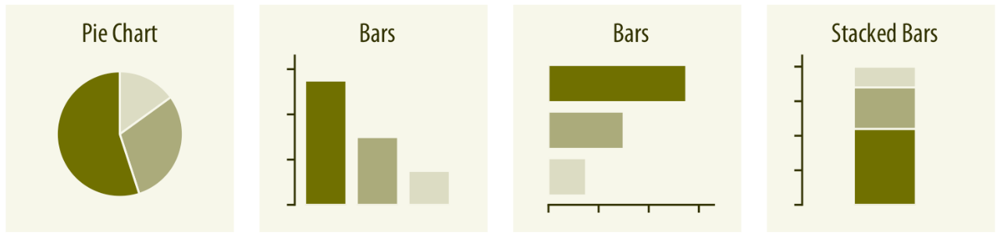

::: smaller-text
Tomado de Fundamentals of Data Visualization, Wilke (2019)
:::

## Gráficas - Proportions

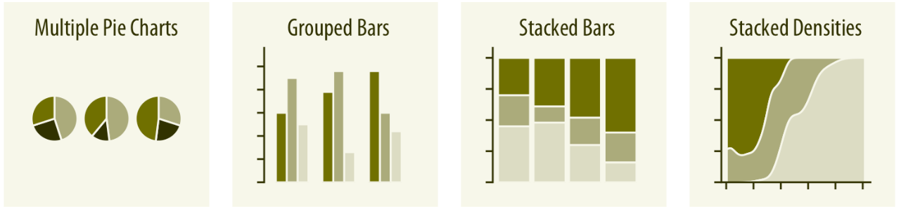

::: smaller-text
Tomado de Fundamentals of Data Visualization, Wilke (2019)
:::

## Gráficas - Proportions

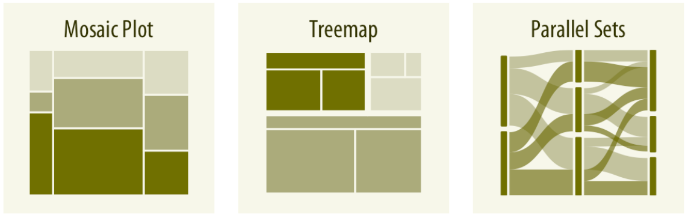

::: smaller-text
Tomado de Fundamentals of Data Visualization, Wilke (2019)
:::

## Gráficas - x–y relationships

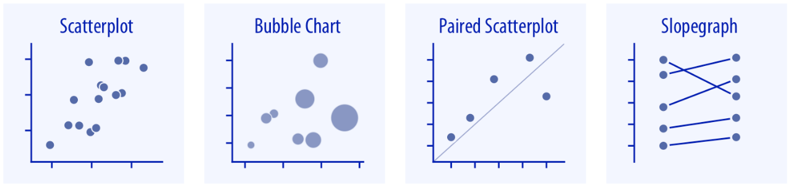

::: smaller-text
Tomado de Fundamentals of Data Visualization, Wilke (2019)
:::

## Gráficas - x–y relationships

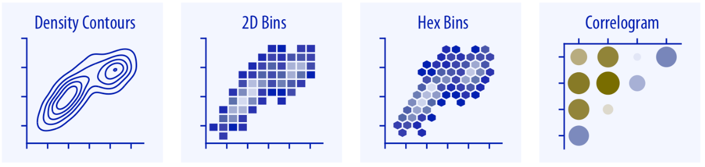

::: smaller-text
Tomado de Fundamentals of Data Visualization, Wilke (2019)
:::

## Gráficas - x–y relationships

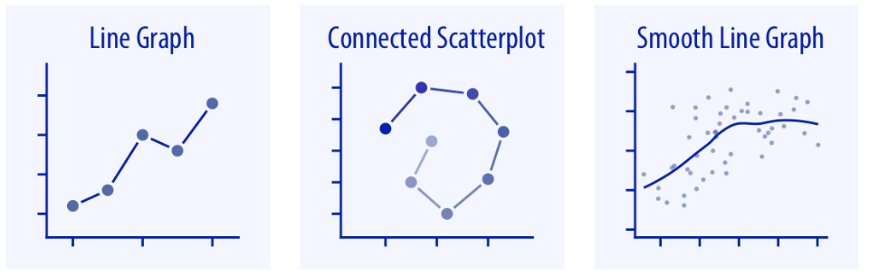

::: smaller-text
Tomado de Fundamentals of Data Visualization, Wilke (2019)
:::

## Gráficas - Geospatial Data

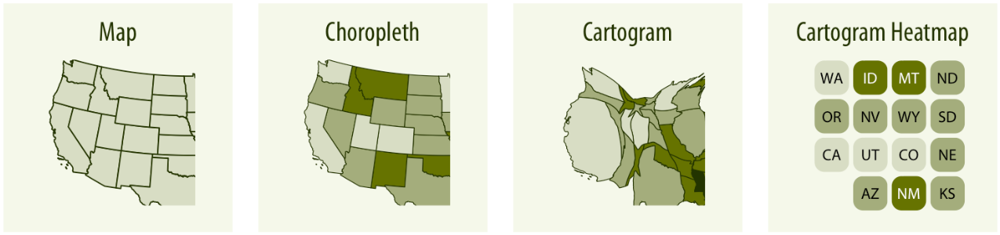

::: smaller-text
Tomado de Fundamentals of Data Visualization, Wilke (2019)
:::

## Gráficas - Uncertainty

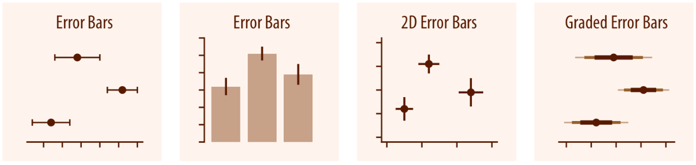

::: smaller-text
Tomado de Fundamentals of Data Visualization, Wilke (2019)
:::

## Gráficas - Uncertainty

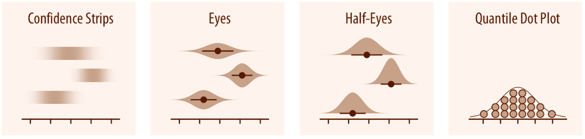

::: smaller-text
Tomado de Fundamentals of Data Visualization, Wilke (2019)
:::

## Gráficas - Uncertainty

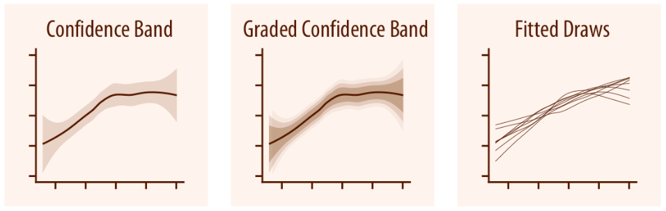

::: smaller-text
Tomado de Fundamentals of Data Visualization, Wilke (2019)
:::

## Libros de Dataviz recomendados

::: columns
::: {.column width="50%"}
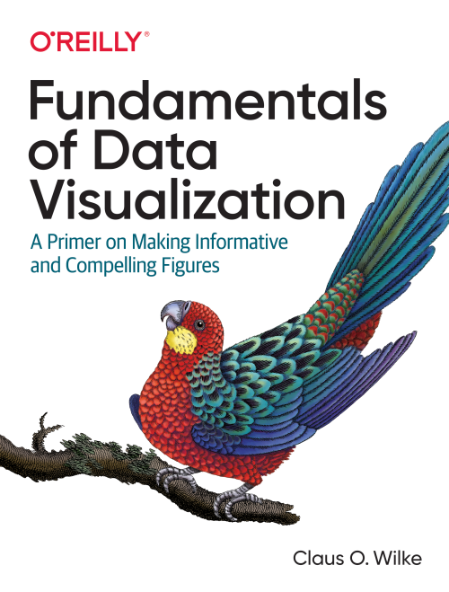
:::

::: {.column width="50%"}
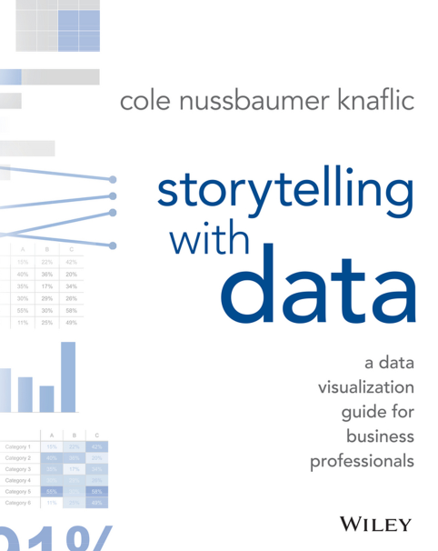
:::
:::

## Páginas de paletas de colores recomendadas

::: columns
::: {.column width="50%"}
<a href="https://coolors.co/palettes/trending" target="_blank">
  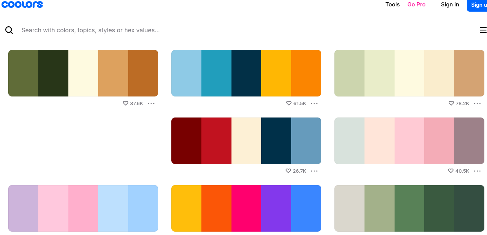
</a>
:::

::: {.column width="50%"}
<a href="https://colorbrewer2.org/#type=sequential&scheme=BuGn&n=3" target="_blank">
  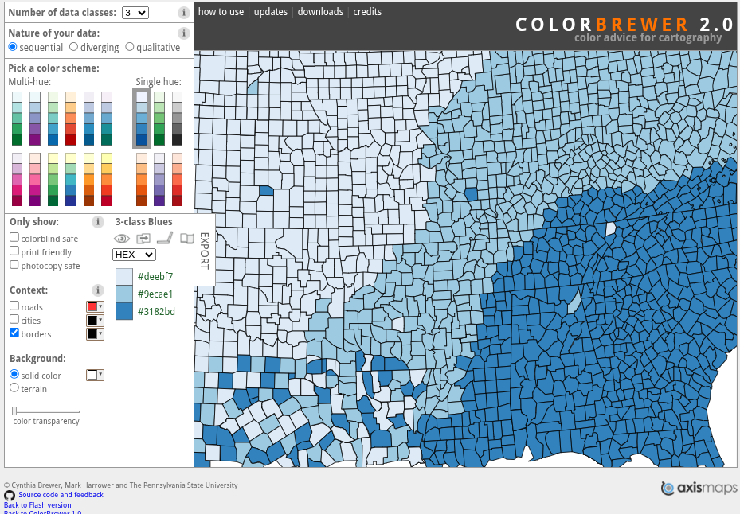
</a>
:::
:::

## Páginas de gráficos

::: columns
::: {.column width="50%"}
**Gráficas en R**

::: nonincremental
- <a href="https://r-graph-gallery.com/" target="_blank">https://r-graph-gallery.com/</a>
- <a href="https://r-charts.com/" target="_blank">https://r-charts.com/</a>
- <a href="https://r-graphics.org/" target="_blank">https://r-graphics.org/</a>
:::
:::

::: {.column width="50%"}
**Gráficas en Python**

::: nonincremental
- <a href="https://python-graph-gallery.com/" target="_blank">https://python-graph-gallery.com/</a>
:::
:::
:::

## Lenguajes de programación

::: fragment
Un lenguaje de programación es un conjunto de instrucciones y reglas que
permiten a los humanos comunicarse con máquinas.
:::


## Lenguajes de programación

"Put simply, programming is giving a set of instructions to a computer
to execute. If you’ve ever cooked using a recipe before, you can think
of yourself as the computer and the recipe’s author as a programmer. The
recipe author provides you with a set of instructions which you read and
then follow. The more complex the instructions, the more complex the
result!"

*Fuente: codecademy.com.*

## Lenguajes de programación

"programming languages are the tools we use to write instructions for
computers to follow. Computers “think” in binary — strings of 1s and 0s.
Programming languages allow us to translate the 1s and 0s into something
that humans can understand and write. A programming language is made up
of a series of symbols that serves as a bridge that allow humans to
translate our thoughts into instructions computers can understand."

*Fuente: codecademy.com.*

### Historia

::: columns
::: {.column width="33%"}
 **Charles Babbage**
(Diciembre 26, 1791 - Octubre 18, 1871)
:::

::: {.column width="33%"}
 **Ada Lovelance** (Diciembre
10, 1815 - Noviembre 27, 1852)
:::

::: {.column width="34%"}
 **Alan Turing** (Junio 23,
1912 - Junio 7, 1954)
:::
:::

### Elementos de los lenguajes de programación

-   **Sintaxis** : reglas que definen la estructura y el formato del
    código.
-   **Semántica** : significado de las instrucciones escritas en el
    lenguaje.
-   **Pragmática** : manera en que se usa el lenguaje de programación
    para resolver un problema.

### Ejemplo de sintaxis

``` r
# Ejemplo correcto
x <- 10
y <- 20

suma <- x+y
print(suma) # Output: [1] 30

# Ejemplo incorrecto
x <- 10
y <- 20

suma <- x+y
print suma # Output: Error: unexpected symbol in "print suma"
```

*Adaptado de Valencia Díaz (2024)*

### Ejemplo de sintaxis

``` r
# Ejemplo correcto de declaración if en R
edad <- 20

if (edad >= 18) {
  print("Eres mayor de edad")
} else {
  print("No eres mayor de edad")
} # Output: [1] "Eres mayor de edad"

# Ejemplo incorrecto de declaración if en R
if edad >= 18 {
  print("Eres mayor de edad")
} else {
  print("No eres mayor de edad")
} # Output: Error: unexpected symbol in "if edad"
```

*Adaptado de Valencia Díaz (2024)*

### Ejemplo de semántica

``` r
# Ejemplo correcto
edad <- 25

ifelse(edad>=18, "Eres mayor de edad", "No eres mayor de edad") # Output: [1] "Eres mayor de edad"

# Ejemplo incorrecto
edad <- as.numeric("veinticinco")

ifelse(edad>=18, "Eres mayor de edad", "No eres mayor de edad")
# Output: Error in if (edad >= 18) { : missing value where TRUE/FALSE needed
```

*Adaptado de Valencia Díaz (2024)*

### Ejemplo de Pragmática

``` r
# Ejemplo correcto
area_circunferencia <- function(radio) {
  area <- pi*radio^2
}

area_calculada <- area_circunferencia(5)

paste0("El área de la circunferencia es ", area_calculada)
# Output: [1] "El área de la circunferencia es 78.5398163397448"


# Ejemplo incorrecto
area_circunferencia <- function(radio) {
  pi <- 3.1416
  area <- pi*radio^2
}

area_calculada <- area_circunferencia(5)

paste0("El área de la circunferencia es ", area_calculada)
# Output: [1] "El área de la circunferencia es 78.54"
```

*Adaptado de Valencia Díaz (2024)*

### Niveles de los lenguajes de programación


### Primera computadora programable multipropósito

{width="70%"}

ENIAC

### Primera computadora programable producida a escala
{width="70%"}

IBM 650

### Lenguajes de programación


### Componentes para usar un lenguaje de programación


### Redes de ayuda


### Consejos al pedir ayuda

::: nonincremental
-   Dar detalles del problema y lo que quiere lograr.
-   Mencionar las versiones de R y R Studio instaladas.
-   Si se intenta usar un paquete, decir cuál es y la versión instalada
    de éste.
-   Copiar y pegar todo el código de error.
-   Pedir el favor y agradecer.
:::

## Lenguaje R


### Componentes de R

::: columns
::: {.column width="33%"}
**Indispensable**
{width="80%"}
Rbase y Rtools
:::

::: {.column width="33%"}
**Optional (IDE)**
{width="80%"}
{width="70%"}
:::

::: {.column width="34%"}
{width="80%"}
{width="80%"}
{width="80%"}
:::
:::

### Librerías en R y Python para ciencia de datos
```{r}
titulos <- c("R", "Python", "Uso")
X1 <- c("ggplot2", "dplyr", "xgboost", "caret", "lubridate", "forecast")
X2 <- c("matplotlib / seaborn", "pandas", "xgboost", "scikit-learn", "pandas", "statsmodels")
X3 <- c("Visualización de datos", "Manipulación de datos", "Machine learning", "Machine learning", "Manipulación de fechas y tiempos", "Modelos estadísticos")


df <- as_tibble(cbind(X1,X2,X3))
colnames(df) <- titulos

df %>% 
  kbl(align = "c") %>% 
  kable_material(c("striped", "hover")) %>% 
  row_spec(1:nrow(df), extra_css = "text-align: center; vertical-align: middle;")
```

### Tidydata


::: small-text
Illustrations from the Openscapes blog Tidy Data for reproducibility, efficiency, and collaboration by Julia Lowndes and Allison Horst
:::

### Tidydata


::: small-text
Illustrations from the Openscapes blog Tidy Data for reproducibility, efficiency, and collaboration by Julia Lowndes and Allison Horst
:::

### Tidydata


::: small-text
Illustrations from the Openscapes blog Tidy Data for reproducibility, efficiency, and collaboration by Julia Lowndes and Allison Horst
:::

### Tidydata


::: small-text
Illustrations from the Openscapes blog Tidy Data for reproducibility, efficiency, and collaboration by Julia Lowndes and Allison Horst
:::

### Tidydata


::: small-text
Illustrations from the Openscapes blog Tidy Data for reproducibility, efficiency, and collaboration by Julia Lowndes and Allison Horst
:::

### Tidydata


::: small-text
Illustrations from the Openscapes blog Tidy Data for reproducibility, efficiency, and collaboration by Julia Lowndes and Allison Horst
:::

### Informes


::: small-text
Artwork from "Hello, Quarto" keynote by Julia Lowndes and Mine Çetinkaya-Rundel, presented at RStudio Conference 2022. Illustrated by Allison Horst.
:::

### Informes


::: small-text
Artwork from "Hello, Quarto" keynote by Julia Lowndes and Mine Çetinkaya-Rundel, presented at RStudio Conference 2022. Illustrated by Allison Horst.
:::

## Tidyverse


## Tidyverse


## Tidyverse


## Creemos nuestro primer informe automatizado de análisis exploratorio

{fig-height=5em}

::: small-text
Artwork by @allison_horst
:::


## Conozcamos a los Pingüinos Palmer
::: columns

::: {.column width="50%"}
  

::: small-text
Artwork by @allison_horst
:::
:::

::: {.column width="50%"}
  

::: small-text
Artwork by @allison_horst
:::

:::
:::

## Teoría de conjuntos

## Técnicas de conteo

## Probabilidad


# Módulo II: Variables aleatorias

::: nonincremental
-   Funciones de distribución y funciones de probabilidad
-   Distribuciones discretas
-   Distribuciones continuas
-   Esperanza matemática
:::

# Módulo III: Inferencia

::: nonincremental
-   Estimación de una y dos muestras
-   Pruebas de hipótesis de una y dos muestras
:::

# Módulo IV: Regresión y muestreo

::: nonincremental
-   Modelos de regresión
-   Muestreo
:::
